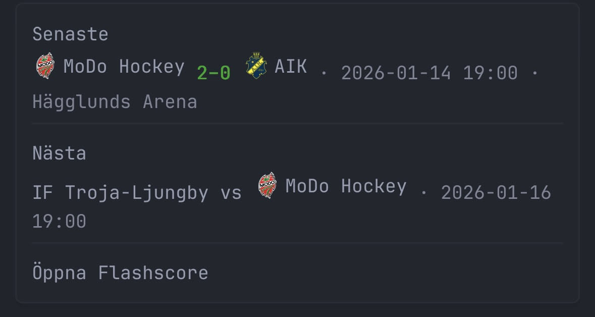

# 🏒 Hockey Schedule API

A small FastAPI microservice that fetches hockey schedules from **stats.swehockey.se**, parses the raw HTML, and exposes a clean JSON API for a specific team.
Designed for dashboards like **Glance**, home-lab widgets, or automation setups.

The API supports **any team**, based on a configurable substring (e.g., `"modo"`, `"aik"`, `"björklöven"`).
No code changes are required — everything is configured via environment variables.



---

## ✨ Features

* Fetches & parses games from one or more Swehockey schedule URLs
* Supports *any* team through a simple environment variable (`TEAM_TAG`)
* Returns both **last played game** and **next upcoming game**
* Automatically fetches **team badges/logos** from TheSportsDB
* Computes match result from your team’s perspective:

  * `"win"`, `"loss"`, `"draw"`
* Lightweight, fast, cache-friendly
* Perfect for use with **Glance dashboards**, Home Assistant, or custom UIs
* Stateless → easy to deploy in Docker, Kubernetes, or k3s

---

## 🚀 Quick Start (Docker)

Run the API for MoDo Hockey:

```bash
docker run -d \
  -p 8000:8000 \
  -e TEAM_TAG="modo" \
  -e SCHEDULE_URLS="https://stats.swehockey.se/ScheduleAndResults/Schedule/18266,https://stats.swehockey.se/ScheduleAndResults/Schedule/18267" \
  -e THESPORTSDB_API_KEY="YOUR_API_KEY" \
  hockey-api:latest
```

Then open:

```
http://localhost:8000/team
```

---

## ⚙️ Configuration

The service is configured entirely with environment variables:

| Variable              | Required | Description                                            | Example                      |
| --------------------- | -------- | ------------------------------------------------------ | ---------------------------- |
| `TEAM_TAG`            | Yes      | Substring used to identify the team (case-insensitive) | `modo`, `aik`, `björklöven`  |
| `SCHEDULE_URLS`       | Recommended | One or more Swehockey schedule URLs (comma/semicolon/newline separated) | `https://.../Schedule/18266,https://.../Schedule/18267` |
| `SCHEDULE_URL`        | Optional | Backward-compatible single schedule URL                | `https://.../Schedule/18266` |
| `THESPORTSDB_API_KEY` | Optional | API key for badge/logo fetching                        | `123` (free tier)            |

### How TEAM_TAG works

The API matches all games where `TEAM_TAG` appears in either team name.
Examples:

| TEAM_TAG | Matches                          |
| -------- | -------------------------------- |
| `modo`   | “MoDo Hockey”, “MODO Hockey Dam” |
| `löven`  | “IF Björklöven”                  |
| `aik`    | “AIK”, “AIK Hockey”              |

---

## 📡 API Endpoints

### `GET /team`

Returns the last played match and the next upcoming match for `TEAM_TAG`.

#### Example JSON output

```json
{
  "team_tag": "modo",
  "team_name": "MoDo Hockey",
  "schedule_urls": [
    "https://stats.swehockey.se/ScheduleAndResults/Schedule/18266",
    "https://stats.swehockey.se/ScheduleAndResults/Schedule/18267"
  ],
  "last_game": {
    "date": "2025-11-26",
    "time": "19:00",
    "home_team": "AIK",
    "away_team": "MoDo Hockey",
    "home_score": 1,
    "away_score": 2,
    "venue": "Hovet, Johanneshov",
    "home_badge": "https://r2.thesportsdb.com/images/media/team/badge123.png",
    "away_badge": "https://r2.thesportsdb.com/images/media/team/badge456.png",
    "team_result": "win"
  },
  "next_game": {
    "date": "2025-11-28",
    "time": "20:30",
    "home_team": "MoDo Hockey",
    "away_team": "IF Björklöven",
    "home_score": null,
    "away_score": null,
    "venue": "Hägglunds Arena",
    "home_badge": "...",
    "away_badge": "..."
  }
}
```

---

## 📦 Docker Compose Example

```yaml
services:
  hockey-api:
    image: hockey-api:latest
    environment:
      TEAM_TAG: "MoDo"
      SCHEDULE_URLS: "https://stats.swehockey.se/ScheduleAndResults/Schedule/18266,https://stats.swehockey.se/ScheduleAndResults/Schedule/18267"
      THESPORTSDB_API_KEY: "YOUR_API_KEY"
    ports:
      - "8000:8000"
```

---

## 🖥️ Using with Glance Dashboard

Here is a minimal Glance widget example:

```yaml
- type: custom-api
  title: Hockey – Matches
  cache: 30m
  url: http://hockey-api:8000/team
```

You can customize it with logos, score colors, etc.

---

## 🏗️ Development

Install dependencies:

```bash
pip install -r requirements.txt
```

Run locally:

```bash
uvicorn app:app --reload --host 0.0.0.0 --port 8000
```

---

## 🧩 How It Works

1. Fetches Swehockey schedule HTML
2. Extracts text and splits it into logical lines
3. Parses:

   * Dates
   * Times
   * Teams
   * Results (if available)
   * Spectators
   * Venue
4. Filters by your `TEAM_TAG`
5. Computes last/next games
6. Fetches badges via TheSportsDB
7. Returns clean JSON suited for dashboards

---

## 🤝 Contributing

Pull requests and issues are welcome!
Ideas for improvements include:

* better parser for irregular Swehockey formats
* multi-team support (`/team/{tag}`)
* caching layer
* tests
* logo provider fallbacks
* automatic schedule discovery

---

## 📄 License

MIT License – you are free to use, modify and distribute.

---
